# HPS Driver para Coprocessador de Zoom em FPGA (DE1-SoC)

## Descriçao do Projeto

Este repositório contém as etapa 2 de um projeto de Sistemas Digitais, focado na criação de um driver de software para um coprocessador de redimensionamento de imagens (zoom in/out) implementado em uma FPGA (DE1-SoC).

O foco principal é a **interface hardware-software** (HPS-FPGA), a criação de uma **API em Assembly (ARMv7-A)** para controle, e uma **aplicação em C** (rodando em Linux embarcado) para orquestrar as operações.

### 🔗 Repositório da Etapa 1 (Hardware-Only)
O coprocessador em Verilog (Etapa 1), que é controlado por este software, pode ser encontrado no repositório:
* **[Digital Zoom: Image Resizing with FPGA in Verilog (DE1-SoC)](https://github.com/antoniomedeiross/image_processing_fpga)**

---

## Sumário

## Visão Geral do Sistema


## Arquitetura da Interface Hardware-Software

A comunicação entre o processador ARM (HPS) e a lógica da FPGA (Coprocessador) é feita via **Memória Mapeada (MMIO)** através da ponte AXI Leve (Lightweight HPS-to-FPGA Bridge).

O fluxo de controle é o seguinte:

**`[App C (Usuário)]`** -> **`[API Assembly (Driver)]`** -> **`[Ponte AXI (MMIO)]`** -> **`[Periféricos FPGA]`**

1.  **Aplicação em C (`main.c`):**
    * Roda no Linux embarcado no HPS.
    * Lida com a interface do usuário (menu, `scanf`).
    * Chama as funções da API Assembly.
2.  **API Assembly (`api_isa.s`):**
    * Define a "ISA" do coprocessador.
    * Recebe ponteiros e valores do C.
    * Gerencia a memória (recebe o ponteiro para o arquivo `.bin` na DDR3, usa `mmap` para acessar a ponte).
    * Executa as instruções ARM (`str`, `ldr`, `dmb`) para escrever/ler diretamente nos endereços físicos dos periféricos na FPGA.
3.  **Periféricos FPGA (no Qsys):**
    * **`onchip_memory2_1` (RAM Dual-Port):** Armazena a imagem fonte (160x120). É escrita pelo HPS (via `api_load_image`) e lida pela ALU.
    * **`pio_10bits` (PIO Output):** Recebe o valor de configuração (`tipo_alg` + `fator_zoom`).
    * **`pio_reset_alu` (PIO Output):** Recebe o pulso de trigger para iniciar o processamento.
    * **`onchip_memory_bloco_ram` (RAM Dual-Port):** Armazena a imagem de saída (640x480). É escrita pela ALU e lida pelo `vga_driver`.


## API da ISA em Assembly

A API do coprocessador foi desenvolvida inteiramente em **Assembly ARM** para fornecer controle direto sobre o hardware da FPGA através da ponte Lightweight HPS-FPGA. A arquitetura implementa uma camada de abstração de hardware (HAL - Hardware Abstraction Layer) que encapsula a ISA (Instruction Set Architecture) do coprocessador de processamento de imagens.


## Funções Principais

### 1. Inicialização e Finalização

#### `iniciar_coprocessador()`
Prepara o sistema para comunicação com a FPGA:
- Abre `/dev/mem` para acesso à memória física
- Mapeia a ponte Lightweight HPS-FPGA (base: `0xFF200000`, span: `192KB`)
- Salva endereço virtual mapeado para acesso posterior
- Utiliza syscalls Linux: `open` (SVC 5) e `mmap2` (SVC 192)

**Exemplo de uso:**
```c
iniciar_coprocessador();
```

#### `encerrar_coprocessador()`
Libera recursos do sistema:
- Desmapeia memória com `munmap` (SVC 91)
- Fecha `/dev/mem` com `close` (SVC 6)

**Exemplo de uso:**
```c
encerrar_coprocessador();
```

---

### 2. Transferência de Dados

#### `carregar_imagem(unsigned char *buffer_hps, int tamanho)`
Transfere imagem da memória DDR3 do HPS para a memória on-chip da FPGA.

**Otimizações implementadas:**
- Transferência em blocos de 4 bytes (words) quando endereços estão alinhados
- Fallback para transferência byte-a-byte se necessário
- Uso de `DSB` (Data Synchronization Barrier) para garantir conclusão das escritas

**Fluxo de transferência:**
```
DDR3 (HPS) → LDR R3, [R4] → Registrador R3 → STR R3, [R5] → FPGA On-Chip Memory
```

**Parâmetros:**
- `buffer_hps`: Ponteiro para buffer na memória do HPS
- `tamanho`: Número de bytes (19.200 para imagens 160x120)

**Exemplo de uso:**
```c
unsigned char *imagem = malloc(19200);
// ... ler arquivo para 'imagem' ...
carregar_imagem(imagem, 19200);
```

**Desempenho:**
- 4.800 operações de 4 bytes (quando alinhado)
- Tempo estimado: ~0.2 ms para 19.200 bytes
- Throughput: ~100 MB/s via ponte Lightweight

#### `limpar_imagem()`
Zera toda a memória de imagem na FPGA (19.200 bytes).

---

### 3. ISA do Coprocessador (Funções de Alto Nível)

A ISA é exposta através de **9 funções semânticas** que encapsulam os opcodes do hardware:

| Função | Opcode | Operação | Saída |
|--------|--------|----------|-------|
| `api_bypass()` | 0 | Sem zoom (1X) | 160x120 |
| `api_media_0_5x()` | 11 | Redução por média | 80x60 |
| `api_media_0_25x()` | 12 | Redução por média | 40x30 |
| `api_vizinho_2x()` | 17 | Ampliação por vizinho | 320x240 |
| `api_vizinho_4x()` | 18 | Ampliação por vizinho | 640x480 |
| `api_vizinho_0_5x()` | 27 | Redução por vizinho | 80x60 |
| `api_vizinho_0_25x()` | 28 | Redução por vizinho | 40x30 |
| `api_replicacao_2x()` | 33 | Ampliação por replicação | 320x240 |
| `api_replicacao_4x()` | 34 | Ampliação por replicação | 640x480 |

#### Exemplo de Implementação (Assembly):
```assembly
api_vizinho_2x:
    PUSH    {LR}
    MOV     R0, #17          @ Carrega opcode 17
    BL      processar_imagem @ Chama função interna
    POP     {PC}
```

#### Exemplo de Uso (C):
```c
// Aplicar zoom 2X por vizinho mais próximo
api_vizinho_2x();

// Reduzir imagem para 0.5X usando média
api_media_0_5x();
```

---

### 4. Funções Internas (Low-Level)

Estas funções **não são expostas** ao código C, sendo utilizadas internamente pela API:

#### `escrever_config(int valor_config)`
- Escreve valor no PIO de configuração (10 bits, offset `0x8010`)
- Aplica máscara `0x3FF` para garantir 10 bits
- Usa `DSB` para sincronização

#### `enviar_star()`
- Gera pulso de trigger no PIO de start (offset `0x8000`)
- Sequência: `1 → delay ~1µs → 0`
- Inicia processamento no coprocessador

#### `processar_imagem(int operacao)`
- Função auxiliar que combina `escrever_config` + `enviar_start`
- Recebe opcode em R0
- Utilizada pelas funções de alto nível

---

### Mapeamento de Memória

**Endereços Físicos:**
- Ponte Lightweight: `0xFF200000` - `0xFF22FFFF` (192 KB)
- Memória On-Chip: Offset `0x0000` (19.200 bytes)
- PIO Config: Offset `0x8010` (registrador de 32 bits)
- PIO Start: Offset `0x8000` (registrador de 32 bits)

### Como o Mapeamento Funciona

1. O programa abre o arquivo especial `/dev/mem`, que dá acesso à memória física do sistema.  
2. A função `mmap()` associa a faixa física `0xFF200000` (ponte Lightweight HPS–FPGA) a um endereço virtual no espaço do processo.  
3. O Kernel configura a MMU e retorna esse endereço virtual, salvo em `FPGA_VIRTUAL_ADDR`.  
4. A partir desse endereço base, o software acessa cada componente do coprocessador somando **offsets**:
| Ponteiro             | Offset   | Função                          |
   |----------------------|----------|----------------------------------|
   | `IMAGE_MEM_ptr`      | `0x0000` | Memória On-Chip (imagem)         |
   | `RESET_PIO_ptr`      | `0x8000` | Controle de start                |
   | `CONFIG_PIO_ptr`     | `0x8010` | Configuração da operação         |
   
Com isso, o programa manipula diretamente o hardware apenas escrevendo ou lendo valores em ponteiros normais, sem precisar de drivers específicos.


**Fluxo de Mapeamento:**

```mermaid
graph TD
    A(["Endereço Físico<br>0xFF200000"]) -->|"mmap2()"| B(["Endereço Virtual<br>FPGA_VIRTUAL_ADDR"])
    B --> C(["IMAGE_MEM_ptr<br>(offset 0x0000)"])
    B --> D(["RESET_PIO_ptr<br>(offset 0x8000)"])
    B --> E(["CONFIG_PIO_ptr<br>(offset 0x8010)"])
```



### Encerrando o Mapeamento

A função `munmap()` é o “oposto” do `mmap()`.  
Ela informa ao sistema operacional que o programa **não precisa mais acessar** aquele trecho de memória física.  
Isso evita vazamentos de memória e garante que os recursos de hardware sejam liberados corretamente.

O uso é simples:

```c 
munmap(fpga_virtual_addr, span);
close(fd_mem);
```

---


## Formato da Instrução (10 bits)

A configuração enviada ao coprocessador segue o formato definido no Problema 1:

```
┌───────────────────────────────────────────────────────┐
│ Bit 9-0: Código da operação (opcode)                  │
│                                                        │
│ Exemplos:                                              │
│ 0b0000000000 (0)  → Bypass (1X)                       │
│ 0b0000001011 (11) → Média 0.5X                        │
│ 0b0000010001 (17) → Vizinho 2X                        │
│ 0b0000100001 (33) → Replicação 2X                     │
└───────────────────────────────────────────────────────┘
```

---

## Vantagens da Implementação em Assembly

### 1. **Controle Total do Hardware**
- Acesso direto via syscalls Linux (SVC)
- Manipulação precisa de registradores
- Controle de barreiras de memória (DSB)

### 2. **Desempenho Otimizado**
- Transferência de dados word-aligned (4 bytes)
- Sem overhead de chamadas de biblioteca
- Execução direta no processador ARM Cortex-A9

### 3. **Encapsulamento da ISA**
- Opcodes definidos apenas no Assembly
- Interface C limpa e semântica
- Facilita manutenção e extensão

---

## Como Compilar e Executar

Este projeto é compilado e executado **diretamente no sistema Linux embarcado na DE1-SoC**.

### 1. Preparar os Arquivos
Baixe esse repositório, em seguida copie os seguintes arquivos para um diretório na sua placa DE1-SoC (ex: via `scp` ou pen drive):

1.  `main.c` (Código C principal)
2.  `coprocessador.s` (API em Assembly)
3.  `coprocessador.h` (O header das funções em assembly)
4.  `saida_cinza.bin` (imagem de teste)
5.  `makefile` (Arquivo Makefile que ajuda na compilação)

### 2. Compilar no quartus
Utilizando o quatus II, compile e exxecute o arquivo .qsys disponível nesse repositório.

### 3. Compilar na Placa
No terminal da DE1-SoC, navegue até o diretório dos arquivos e execute:

```bash
# Compila o C e o Assembly juntos, linkando-os e roda o executável em seguida
make run 
